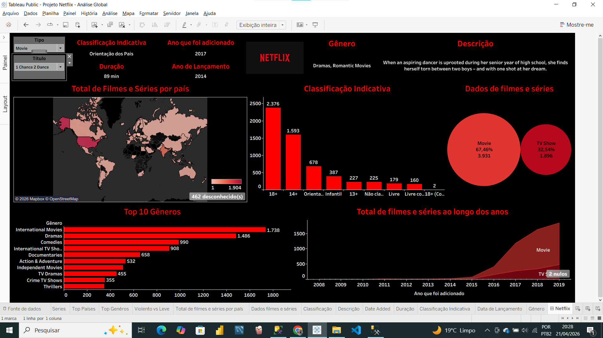

# 🎬 Análise de Dados Netflix: Do SQL ao Dashboard Estratégico

Este projeto apresenta uma análise de ponta a ponta do catálogo global da Netflix. O objetivo foi transformar dados brutos em insights estratégicos sobre o crescimento da plataforma, gêneros mais populares e a representatividade do conteúdo brasileiro.

---

## 🎯 Problema de Negócio

A Netflix possui um catálogo vasto e em constante mudança. Para entender a direção da plataforma, esta análise buscou responder:
1.  Como o volume de conteúdo cresceu nos últimos anos?
2.  Qual a distribuição entre Filmes e Séries (TV Shows)?
3.  Quais são os gêneros predominantes e quem são os principais atores?
4.  Como o Brasil está posicionado no catálogo global?

---

## 📊 Dashboard Interativo
> **[Acesse aqui o Dashboard no Tableau Public](https://public.tableau.com/views/ProjetoNetflix-AnliseGlobal/Netflix?:language=pt-BR&publish=yes&:sid=&:redirect=auth&:display_count=n&:origin=viz_share_link)**

*Visualização desenvolvida no Tableau focada em distribuição geográfica, classificação indicativa e tendências temporais.*

---

## 🛠️ Tecnologias e Ferramentas

- **SQL Server:** Limpeza, manipulação de strings (Split) e criação de Views.
- **Python (Pandas):** ETL inicial e tratamento de dados.
- **Tableau:** Storytelling de dados e criação de dashboards interativos.

---

## 📂 Estrutura do Repositório

- **[/SQL](./SQL):** Scripts das consultas realizadas.
- **[/notebook](./notebook):** Jupyter Notebook com o tratamento inicial dos dados.
- **[/visualizacao](./visualizacao):** Arquivo `.twbx` do Tableau.
- **[/dados](./dados):** Dataset utilizado na análise.

---

## 🔍 Destaques do Script SQL

O tratamento dos dados no SQL foi fundamental para a precisão das análises. Alguns exemplos do que foi desenvolvido:

* **Tratamento de Dados Multivalorados:** Uso de `CROSS APPLY` e funções de Split para separar gêneros e atores listados em uma única célula.
* **Análise de Conteúdo:** Classificação semântica de títulos "Violentos" vs "Leves" via `CASE WHEN` e `LIKE`.
* **Arquitetura para BI:** Criação de `VIEWS` otimizadas para alimentar o Tableau de forma eficiente.

📈 Principais Insights
Domínio de Filmes: O catálogo é composto por aproximadamente 67% de filmes e 33% de séries.

Expansão Brasileira: Identificamos um crescimento constante de produções originais no Brasil a partir de 2016.

Público Adulto: A maior concentração de títulos está na classificação 18+ (Adulto).

Autora: Gabriela Tavares

Formação: Sistemas de Informação pela Universidade Federal de Mato Grosso do Sul.
